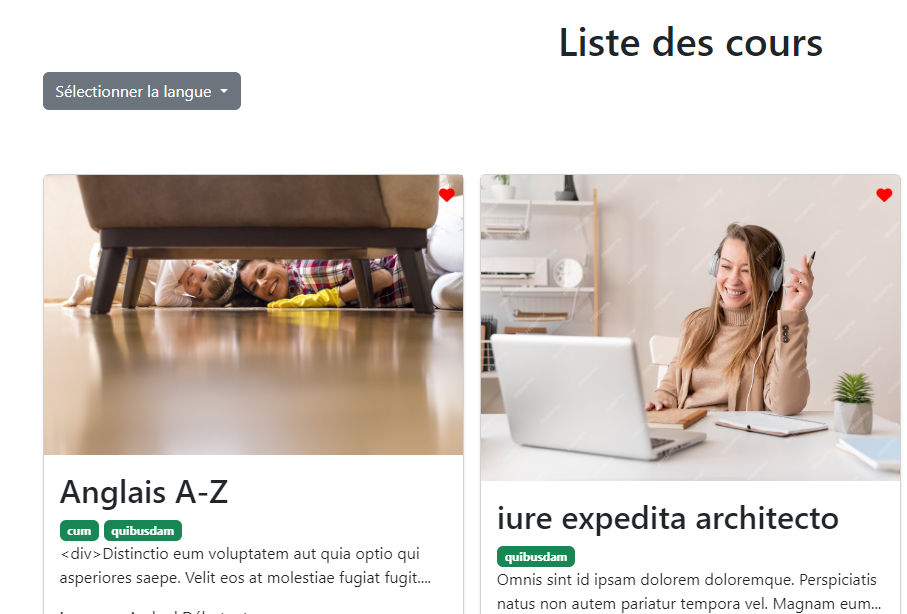
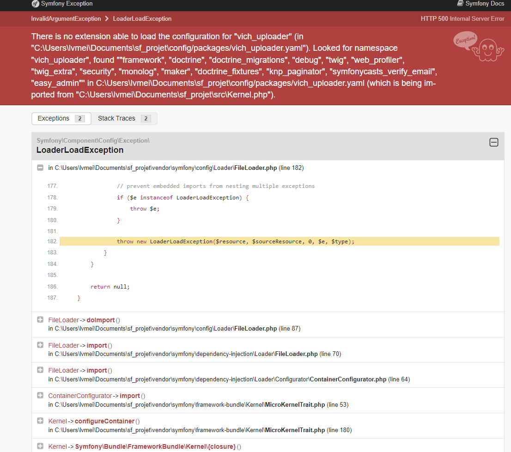

# Projet Symfony - LOLanguages

## Introduction

Suite au projet précédent réalisé en PHP natif, j'ai décidé de refaire ce projet en utilisant le framework Symfony (version 6.4) et la bibliothèque Bootstrap 5.

Dans ce projet, plusieurs fonctionnalités ont été implémentées :

### 1. Entités

L'entité `Course` est l'une des entités les plus importantes pour présenter les données aux utilisateurs. Elle est liée aux autres entités avec des relations `ManyToOne` (entités `Teacher`, `Level`, `Language`) et `ManyToMany` (`Tag`, `favori`).

L'entité `User` possède deux types de rôles, `ROLE_USER` (par défaut) et `ROLE_ADMIN`. Cette partie sera expliquée dans la section de contrôle d'accès.

D'ailleurs, afin de garantir que la base de données ne contienne pas plusieurs enregistrements avec le même e-mail, j'ai spécifié que le champ "**email**" doit être unique.

> Dans User.php

```php
#[UniqueEntity(fields: ['email'], message: 'Cet email existe déjà !')]
```

L'utilisation de cette annotation est dédiée à cet objectif précis.

## 2. Controller

### 2.1 `Course`

Pour gérer les différentes classes, on doit utiliser le générateur (maker) pour créer des contrôleurs afin de communiquer avec les modèles et de rendre des vues sur le navigateur.

Dans le contrôleur `Course`, j'ai créé des pages pour afficher tous les cours, ainsi qu'une route pour accéder à la page présentant les détails d'un cours sélectionné selon son identifiant `{id}`.

### 2.2 `Security`

Le contrôleur de sécurité prend en charge les pages de connexion (`/login`) et de déconnexion (`/logout`) pour les utilisateurs. Dans ce contrôleur, j'ai incorporé l'objet `AuthenticationUtils` afin de récupérer des détails relatifs à la dernière tentative de connexion, tels que d'éventuelles erreurs et le dernier nom d'utilisateur saisi.

### 2.4 `Registration`

Pour instaurer la fonctionnalité d'inscription, j'ai employé la commande `php bin/console make:registration-form` pour créer le contrôleur dédié. Ce dernier est spécialement conçu pour superviser le processus d'inscription, comportant des mécanismes intégrés pour valider l'adresse e-mail soumise par l'utilisateur.

De plus, ce contrôleur génère automatiquement un formulaire préconfiguré qui intègre des fonctionnalités telles que la vérification de l'e-mail, le hachage des mots de passe, et d'autres aspects liés à l'inscription.

## 3. Fixtures

Une fois la base de données créée, j'ai utilisé le package de fixtures pour générer des fausses données plutôt que de saisir manuellement des données.

:::caution Respecter l'ordre
Comme l'entité `Course` est du côté **propriétaire** (qui détient les clés étrangères), il est nécessaire de mettre les autres classes avant la classe `Course`. Sinon, des cases vides apparaîtront pour les colonnes mappées (comme `language`, `teacher`, `level`) après l'exécution de `flush()`.
:::

## 4. Event Subscriber

Sur la page des cours, j'ai créé une liste déroulante des langues. Si l'utilisateur choisit une langue, tous les cours correspondant à la langue sélectionnée seront affichés.



Pour réaliser cela, j'ai importé la classe `Environment` de Twig pour manipuler l'environnement Twig.

Dans la classe `DropDownLangSubscriber`, j'ai déclaré une constante sous forme de **tableau** qui contient les noms des routes écoutant cet événement (ici, uniquement la page des cours écoute cet événement, mais imaginons qu'il y ait d'autres pages voulant utiliser la même fonction, on peut ajouter d'autres routes).

> EventSubscriber/DropDownLangSubscriber.php

```php
class DropDownLangSubscriber implements EventSubscriberInterface

{
  const ROUTES = ['course_page'];
  public function __construct(
    private LanguageRepository $languageRepository,
    private Environment $twig
    ){

  }
  public function injectGlobalVariable(RequestEvent $event):void
  {
      $route = $event->getRequest()->attributes->get('_route');
      if(in_array($route, self::ROUTES)) {
         $languages = $this->languageRepository->findAll();
         $this->twig->addGlobal('allLangues', $languages);
      }
  }
  public static function getSubscribedEvents()
  {
    return [KernelEvents::REQUEST=>'injectGlobalVariable'];
  }
}
```

Quand un événement Request est déclenché, la fonction `injectGlobalVariable` est exécutée. Si le nom de la route actuelle est dans la liste définie par la constante `Route`, toutes les langues sont récupérées dans `LanguageRepository` et injectées comme **variable globale** dans Twig.

## 5. EasyAdmin

Pour les opérations CRUD, seuls les utilisateurs ayant le rôle `ROLE_ADMIN` peuvent y accéder. Lorsqu'un administrateur se connecte, un élément **Administration** apparaît dans la liste déroulante, sinon, il reste invisible.


:::note Problème d'affichage des flèches en double

Après la connexion, des flèches doubles apparaissent. J'ai vérifié les ressources dans la console, malheureusement, je n'ai pas réussi à résoudre ce problème.

:::

Sur la page `/admin`, il est possible de modifier toutes les données concernant les cours et les utilisateurs.

### 5.1 configureCrud & configureFields

Dans les contrôleurs d'EasyAdmin, j'ai personnalisé les champs de saisie pour le mode d'affichage.

```php
   public function configureCrud(Crud $crud): Crud
    {
        return $crud->setEntityLabelInPlural("Utilisateurs")
                    ->setEntityLabelInSingular("Utilisateur")
                    ->setPageTitle("index", "LOLanguages - Admin des utilisateurs")
                    ->setPaginatorPageSize(10);
    }

    public function configureFields(string $pageName): iterable
    {
        return [
            IdField::new('id')
                   ->hideOnForm()//ne pas afficher le champs de id,
            TextField::new('email')
                   ->setFormTypeOption('disabled', 'disabled'),// désactiver le champs de email
            TextField::new('fullname'),
            TextField::new('pseudo'),
            ArrayField::new('roles'),
        ];
    }
```

Par exemple, j'ai ajusté le titre pour qu'il soit en français (par défaut, il est en anglais).


J'ai également mis en place la possibilité de choisir quels champs afficher et lesquels ne pas afficher, ainsi que des fonctions de désactivation pour empêcher toute modification par les administrateurs. Dans cet exemple, je présente la configuration spécifique de l'entité `User`.

Par ailleurs, j'ai intégré un champ de rôle qui facilite la gestion des opérations liées aux rôles des utilisateurs.


## 6. Authentification & Contrôle d'accès

Pour pouvoir authentifier les utilisateurs, j'ai exécuté une ligne de commande avec make:auth qui génère automatiquement un formulaire de login et un Authenticator.

D'ailleurs, maker va automatiquement inscrire notre authentification derrière un pare-feu nommé main :

```yaml
security:
    password_hashers:
        Symfony\Component\Security\Core\User\PasswordAuthenticatedUserInterface: "auto"
    providers:
        app_user_provider:
            entity:
                class: App\Entity\User
                property: email
    firewalls:
        dev:
            pattern: ^/(_(profiler|wdt)|css|images|js)/
            security: false
        main:
            lazy: true
            provider: app_user_provider
            custom_authenticator: App\Security\UserAuthenticator
            logout:
                path: app_logout
            remember_me:
                secret: "%kernel.secret%"
                lifetime: 604800
                path: /
                always_remember_me: true
```

L'`Authenticator` contient une méthode authenticate, qui va être chargée de réaliser l'authentification à partir de la requête entrante.

Sur la page d'accueil, tous les utilisateurs peuvent voir les cours, mais en cliquant sur un cours détaillé, ils sont redirigés directement vers la page de connexion, car elle est **réservée aux utilisateurs inscrits**.

```yaml
access_control:
    - { path: ^/admin, roles: ROLE_ADMIN }
    - { path: ^/course, roles: IS_AUTHENTICATED_FULLY }
```

Comme mentionné précédemment, l'accès à la page **Dashboard** est **réservé aux utilisateurs ayant le rôle administrateur**.

### 7. Fonctionnalités "Favoris"

Afin de concrétiser la fonctionnalité "Favoris", que je n'avais pas implémentée dans mon projet précédent en PHP, j'ai décidé de l'intégrer à ce nouveau projet. Comme précisé précédemment, la relation entre les entités `User` et `Course` est de type `ManyToMany`.

L'objectif de cette fonctionnalité est de permettre aux utilisateurs d'ajouter des cours à leurs favoris, afin de les consulter ultérieurement.

Sur chaque carte de cours, une icône en forme de cœur, initialement de couleur grise, est affichée. Lorsqu'un utilisateur clique sur cet icône, la couleur du cœur passe au rouge, et un avis s'affiche pour informer l'utilisateur que "**Ajouter au favori avec succès**". En cas d'un deuxième clic, une autre notification apparaît indiquant "**Supprimer favori**", et la couleur de l'icône redevient grise.


Dans le compte de l'utilisateur:


Pour réaliser cela, il est nécessaire de vérifier si l'utilisateur a déjà ajouté ce cours à ses favoris. Dans le cas contraire, le cours peut être ajouté à la liste des favoris.

> Dans l'entité `User` (`User.php`)

```php
public function addFavorite(Course $favorite): static
    {
        if (!$this->favorites->contains($favorite)) {
            $this->favorites->add($favorite);
        }

        return $this;
    }
```

Ensuite, dans le contrôleur Course, j'ai ajouté une fonction `toggleFavorites` pour gérer les demandes des utilisateurs, ce qui permet de basculer entre **l'ajout** et la **suppression** des favoris.

> Dans CourseController.php

```php
#[Route('/toggle-favorite/{id}', name:'toggle_favorite', methods: ['POST'])]
    public function toggleFavorites(Course $course, EntityManagerInterface $manager): JsonResponse
    {
        $user = $this->getUser();
        if (!$user) {
            return new JsonResponse(['message' => 'Utilisateur non authentifié'], JsonResponse::HTTP_UNAUTHORIZED);
        }

        if ($course->isFavoritedBy($user)) {
           $course->removeFavoritedBy($user);
           $manager->flush();
           return $this->json(['message'=> 'Votre favori a été supprimé.'], JsonResponse::HTTP_OK);
        }

        $course->addFavoritedBy($user);
        $manager->flush();

        return new JsonResponse(['message' => 'Ajouter au favori avec succès']);
        }

```

Enfin, pour traiter les demandes d'ajout ou de suppression des favoris, j'ai opté pour l'utilisation de la bibliothèque **Axios** (`js/App.js`).

### 8. Pagination

Pour intégrer la fonctionnalité de pagination, j'ai opté pour l'utilisation du package [KnpPaginatorBundle](https://github.com/KnpLabs/KnpPaginatorBundle).

En toute simplicité, je fais un `type-hint` de cette classe dans le contrôleur où elle est nécessaire, comme dans mon exemple, j'ai défini 6 d'affichage de cours par page :

> CourseController.php

```php
 #[Route('/', name: 'course_page')]
    public function list(Request $request, PaginatorInterface $paginator, LanguageRepository $languageRepository): Response
    {

        $languages= $languageRepository->findAll();
        $courses = $paginator->paginate(
            $this->courseRepository->findAll(),
            $request->query->getInt('page', 1),
            6
        );

        return $this->render('course/index.html.twig', [
            'courses' => $courses,
            'languages'=>$languages
        ]);
    }
```

Pour que cette configuration fonctionne, il est nécessaire d'inclure un morceau de code suivant un exemple dans le template Twig :

```php
<div class="navigation d-flex justify-content-center my-5">
    {{ knp_pagination_render(courses) }}
</div>
```

Cela assure une pagination fluide et efficace des cours, améliorant ainsi l'expérience utilisateur lors de la navigation à travers les pages de résultats.

## 10. Uploads images

Initialement, j'avais l'intention d'utiliser le package [VichUploaderBundle](https://github.com/dustin10/VichUploaderBundle) pour permettre aux utilisateurs de télécharger des images lorsqu'ils choisissent une photo pour leur avatar. Bien que j'aie suivi les étapes de la documentation, cela n'a pas fonctionné comme prévu, et des erreurs sont apparues, comme indiqué ci-dessous (j'ai commenté les parties du code relatives à Vich pour les examiner ultérieurement) :



Afin de mettre en œuvre cette fonctionnalité, je me suis référé à la documentation **Symfony 6.4** et ai suivi les étapes suivantes :

-   Configurer le chemin des images téléchargées dans le fichier services.yaml :

    ```yaml
    parameters:
        app.admin_email: "admin@lol.com"
        photo_dir: "%kernel.project_dir%/public/uploads/images"
    ```

-   Ensuite, dans le fichier `RegistrationController.php` :

```php
 #[Route('/register', name: 'app_register')]
   public function register(
       Request $request,
       ...
       VerifyEmailHelperInterface $verifyEmailHelper,
       SluggerInterface $slugger

   ): Response
   {
       $user = new User();
       $form = $this->createForm(RegistrationFormType::class, $user);
       $form->handleRequest($request);

       if ($form->isSubmitted() && $form->isValid()) {
           $profilImage = $form->get('profileUser')->getData();
           if($profilImage){
               $originalFilename = pathinfo($profilImage->getClientOriginalName(), PATHINFO_FILENAME);
               $safeFilename = $slugger->slug($originalFilename);
               $newFilename = $safeFilename.'-'.uniqid().'.'.$profilImage->guessExtension();

               try {
                   $profilImage->move(
                       $this->getParameter('photo_dir'),
                       $newFilename
                   );
               } catch (FileException $e) {

               }

               $user->setProfileUser($newFilename);
               //...autres codes
           }
       }
   }
```

-   Enfin, dans le formulaire d'inscription (`Form/RegistrationFormType.ph`p), personnalisez ce champ comme suit :

```php
     class RegistrationFormType extends AbstractType
    {
   public function buildForm(FormBuilderInterface $builder, array $options): void
   {
       $builder
          ...
           ->add('profileUser', FileType::class, [
               'required'=>false,
               'mapped' => false,
               'constraints'=>[
                   new Image([
                       'maxSize'=>'5000k',
                       'mimeTypesMessage' => 'Le format d\'image est invalide.',
                   ],
                   )
               ],
               'label'=>'Télécharger votre photo',
               'label_attr'=>[
                   'class'=>'form-label'
               ],
               'attr'=>[
                   'class'=>'form-control'
               ]

           ])
           ...
       ;
   }
}

```

## Conclusion

Au terme de 4 semaines d'immersion dans l'apprentissage de Symfony, j'ai acquis une compréhension qui a redéfini mes perspectives sur le développement en PHP. Bien que le processus ait été rempli de défis et de moments de frustration, A travers ce projet, j'ai pu quand même mettre en œuvre plusieurs fonctionnalités clés, telles que la gestion des entités, les contrôleurs, la sécurité avec le composant Symfony Security, l'inscription des utilisateurs avec l'Authenticator, la gestion des rôles, la pagination avec le bundle KnpPaginator, l'utilisation d'EasyAdmin pour l'administration CRUD, et la mise en place de la fonctionnalité "Favoris".

### points à améliorer

#### Gestion des e-mails (Mailer)

Plutôt que de créer un e-mail spécifique pour informer les utilisateurs de leur inscription réussie via la newsletter, comme illustré dans le cours, j'ai choisi de le réorienter vers la réussite de la création de compte à partir de la page d'inscription. `

Bien que j'aie utilisé la commande `make:registration-form` pour générer automatiquement les fichiers nécessaires en lien avec le formulaire d'inscription, la gestion du Mailer reste un point d'interrogation pour moi. J'ai tenté de configurer les classes nécessaires dans le fichier `Service/EmailNotification.php`, mais malheureusement, cela n'a pas produit les résultats escomptés. Je m'efforcerai de comprendre plus en profondeur le fonctionnement du Mailer de Symfony afin d'optimiser cette fonctionnalité.

Pour réaliser cette partie de l'exercice portant sur le **test d'envoi d'e-mails**, j'ai mis en place un nouveau formulaire de contact en utilisant le `ContactController`, le formulaire `ContactType`, l'entité `Contact`, etc.

Sur la page de contact, tous les utilisateurs, qu'ils soient inscrits ou non, ont la possibilité d'envoyer des messages. Pour les utilisateurs inscrits, leurs noms, prénoms et adresses e-mail s'affichent automatiquement dans les champs correspondants du formulaire.


En utilisant les configurations de mailer_dsn du cours, j'ai effectué des tests d'envoi d'e-mails. Malheureusement, je n'ai rien reçu dans ma boîte de réception. Cependant, les données sont correctement enregistrées dans la base de données. Afin de résoudre ce problème, j'ai créé une nouvelle configuration mailer_dsn, mais malgré cela, je n'ai toujours rien reçu, et aucune erreur n'est affichée.

Comme je n'ai rien reçu, je n'ai pas pu passer à l'étape suivante consistant à refactoriser le code dans un autre fichier.

#### Champs de recherche

Dans ce projet, j'ai cherché à implémenter une fonctionnalité de barre de recherche permettant aux utilisateurs de trouver leurs cours en fonction des mots clés saisis. Pour cela, j'ai mis en place une fonction dans le contrôleur `IndexController`, créé un formulaire `SearchType`, défini un modèle `SearchData` dans le répertoire `Model`, etc. Cependant, je n'ai pas réussi à faire fonctionner la barre de recherche comme prévu. En raison des contraintes de temps, je n'ai pas pu résoudre ce problème avant la date limite de rendu du projet. C'est donc un aspect que je prévois d'améliorer et de développer dans un avenir proche.

Malgré ces défis, cette expérience a renforcé dans une certaine mesure ma compréhension de Symfony. Je suis consciente des aspects à améliorer et suis motivée à continuer à apprendre et à perfectionner mes compétences Symfony dans mes projets futurs.
